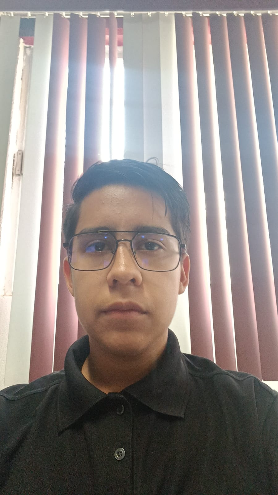
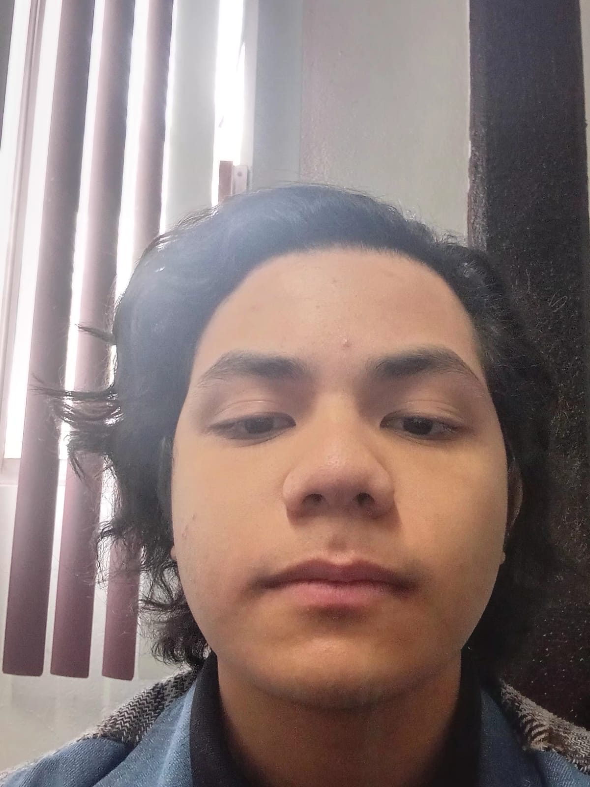

# Tracker FM

## Objetivo Principal
El proyecto Tracker FM busca crear una red social musical que permita a los usuarios registrar, organizar y compartir la música que escuchan diariamente. La idea es hacer del consumo musical una experiencia social, visual e interactiva, donde cada usuario pueda documentar su gusto musical y expresarlo a través de reseñas. Además, el objetivo es ayudar a los usuarios a descubrir nuevos perfiles de usuarios con intereses similares.

## Objetivo secundario
Aprobar la materia y unificarlas

## Informacion Personal

### Integrante 1:
- **Nombre**: Galvan Diaz Angel Giancarlo
- **Edad**: 18
- **Grado y grupo**: 6D
- **Numero de control**: 23308060610564
- **Correo Electronico**: 23308060610564@cetis61.edu.mx
- **Foto**:

### Integrante 2:
- **Nombre**: Ruiz Campos Andre Dacey
- **Edad**: 18
- **Grado y grupo**: 6D
- **Numero de control**: 23308060610332
- **Correo Electronico**: 23308060610332@cetis61.edu.mx
- **Foto**:

